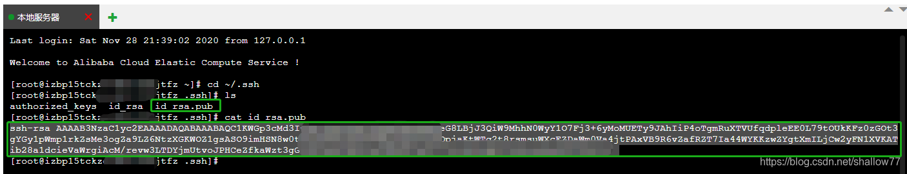
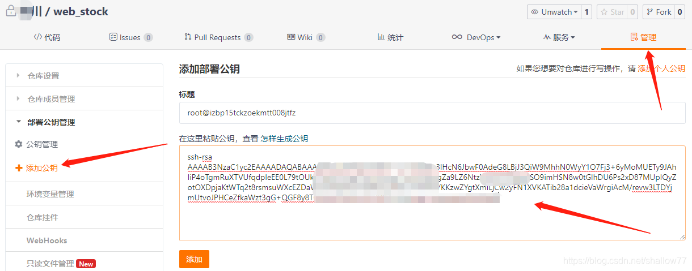
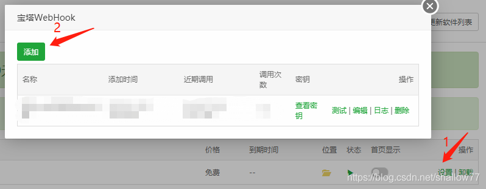
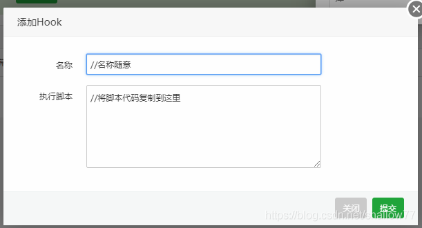
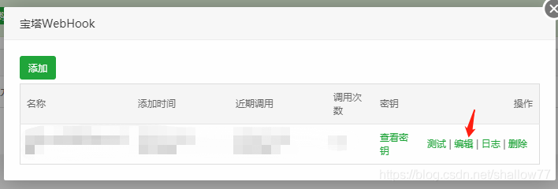
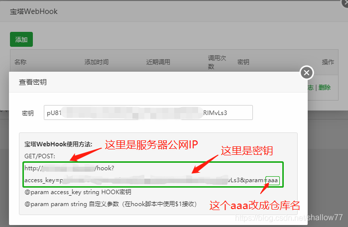
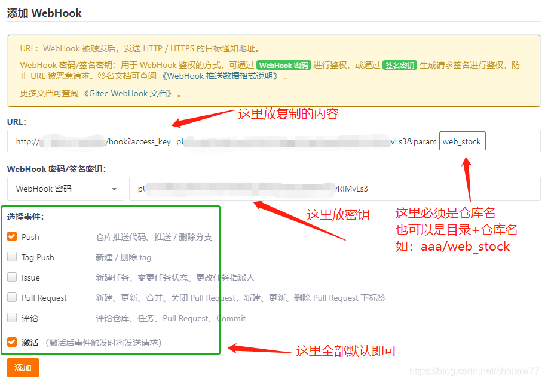
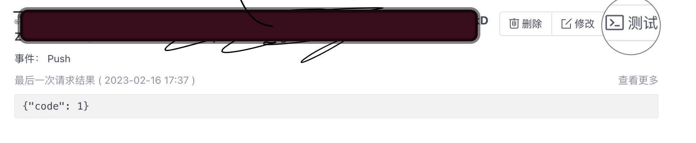
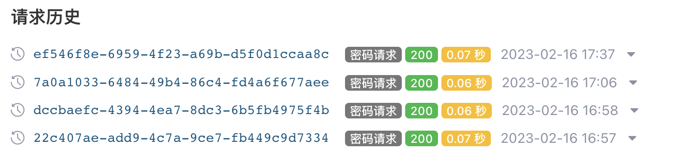

# {{ $frontmatter.title }}

前言
 我们想要实现的功能是：在本地吧代码推送至仓库后，直接同步至服务器

## 准备工作
> 本文服务器环境为centOS7  
> 安装了[宝塔](https://www.bt.cn/new/download.html)  
> 最好要掌握 Git,Gitee的基本操作  

## 实现步骤

1. 首先要去宝塔终端查看是否安装`Git`(一般默认是安装了的)
   ```sh
    git --version
   ```
2. 生成公钥
   ```sh
    ssh-keygen -t rsa
   ```
   输入这串命令后一直回车,如果中途需要输入[y/n]请输入y
   生成公钥后,我们去查看公钥

   ```sh
    cd ~/.ssh
    ls
    cat id_rsa.pub
   ```

   复制绿色框部分全部内容，这就是生成的SSH密钥
   
3. 创建Git仓库,添加公钥  
   仓库就简单的默认仓库就好,要记好仓库名,进入仓库管理的添加公钥功能,将上面复制的密钥copy进底下后,标题会自动生成,直接点击添加即可。  
     
4. 宝塔安装`WebHook`并配置
   在宝塔界面的软件商店里搜索webhook并安装，安装成功后添加脚本  
     
     
   脚本代码(不用修改东西)[脚本来源](https://blog.csdn.net/shallow77/article/details/110292878)
   ```sh
   #!/bin/bash
    echo ""
    #输出当前时间
    date --date='0 days ago' "+%Y-%m-%d %H:%M:%S"
    echo "Start"
    #判断宝塔WebHook参数是否存在
    if [ ! -n "$1" ];
    then 
            echo "param参数错误"
            echo "End"
            exit
    fi
    #git项目路径
    gitPath="/www/wwwroot/$1"
    #git 网址
    gitHttp="https://gitee.com/xxx/$1.git" //自己仓库的链接
    echo "Web站点路径：$gitPath"
    #判断项目路径是否存在
    if [ -d "$gitPath" ]; then
            cd $gitPath
            #判断是否存在git目录
            if [ ! -d ".git" ]; then
                    echo "在该目录下克隆 git"
                    sudo git clone $gitHttp gittemp
                    sudo mv gittemp/.git .
                    sudo rm -rf gittemp
            fi
            echo "拉取最新的项目文件"
            #sudo git reset --hard origin/master
            sudo git pull        
            echo "设置目录权限"
            sudo chown -R www:www $gitPath
            echo "End"
            exit
    else
            echo "该项目路径不存在"
                    echo "新建项目目录"
            mkdir $gitPath
            cd $gitPath
            #判断是否存在git目录
            if [ ! -d ".git" ]; then
                    echo "在该目录下克隆 git"
                    sudo git clone $gitHttp gittemp
                    sudo mv gittemp/.git .
                    sudo rm -rf gittemp
            fi
            echo "拉取最新的项目文件"
            #sudo git reset --hard origin/master
            sudo git pull
            echo "设置目录权限"
            sudo chown -R www:www $gitPath
            echo "End"
            exit
    fi
   ```
   保存后我们重启宝塔(或重启服务器)  
   重启后，进入软件商店，查看我们宝塔WebHook生成的密钥，复制绿色框里的内容  
     
     
5. 配置Gitee的WebHooks  
   进入仓库的WebHooks功能页面(进入仓库 --> 管理 --> 左侧列表有WebHooks)  
   这部分看图片内容弄，需要注意的是URL最后的aaa必须最后一个是仓库名，前面可以根据自己想放的位置添加父级目录  
   
6. 将Gitee仓库clone到服务器的本地目录中  
   先在宝塔终端设置我们的Git信息
   ```sh
    git config --global user.name "用户名"
    git config --global user.email "邮箱"
    git config --global credential.helper store //会生成.gitconfig 的文件
    cat ~/.gitconfig  //显示内容
   ```
   然后进入到你要放文件的目录下,将仓库clone下来,然后输入账号密码
   ```sh
    cd /www/wwwroot/
    git clone https://gitee.com/XXX/XXX.git  //clone后面是下载链接
   ```
7. 成功后就已经配置好了,我们可以来到Git仓库的WebHook界面来测试  
     
   点击测试后,点击查看更多如果返回值是200,那么就代表成功了
     
## 后续更新
> 根据上方步骤就已经成功了,我们即可吧代码同步至服务器`这样的话每次提交需要将项目打包然后吧dist目录也提交上去` ，如果我们需要配置域名  
> 方法1:通过宝塔 ---> 网站 ---> 设置 ---> 网站目录,从新选择目录到我们📦后的dist目录下 
> 方法2:自己配置ngxin代理,安装好nginx后在nginx.conf文件中配置如下代码
```sh
    server{
        listen 80; # 如果有 https 的话 请再添加443端口的监听
        server_name xxx.xxx.xxx # 域名;
        location / {
            root /www/wwwroot/xxx.xxx.xxx/xxx/dist;
            index index.html index.htm;
        }
    }
```

[返回](/page/index)