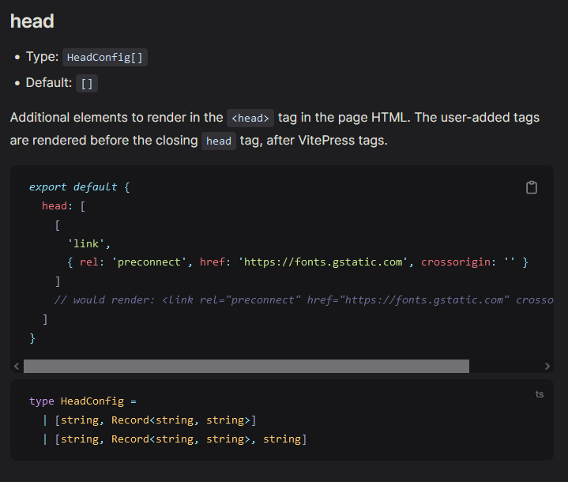

# {{ $frontmatter.title }}

# 在config.js中添加`head`属性
    官方文档

    因为官方文档没有中文的哈，所以机翻过来看起来不是很易懂
    具体写法可以写成
```js
    // config.js
    // head 的配置是在 themeConfig之外的
    export default defineConfig({
        ...
         head: [
            [
                "script",
                {},
                `var _hmt = _hmt || [];
                (function() {
                var hm = document.createElement("script");
                hm.src = "https://hm.baidu.com/hm.js?xxxxxx";
                var s = document.getElementsByTagName("script")[0]; 
                s.parentNode.insertBefore(hm, s);
                })();`,
            ],
        ],
    })
```